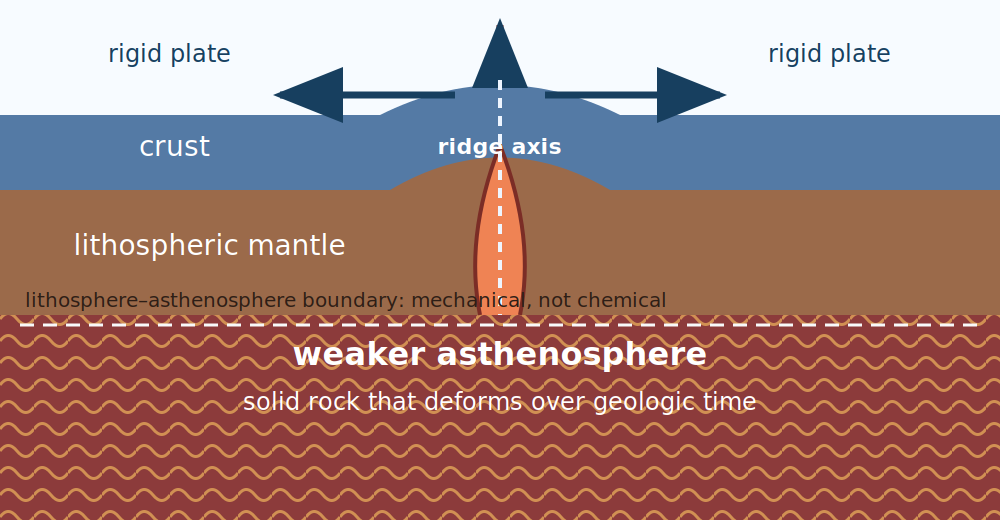
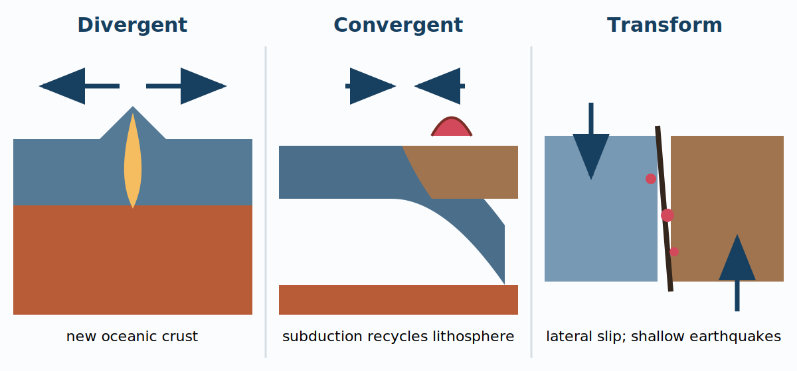
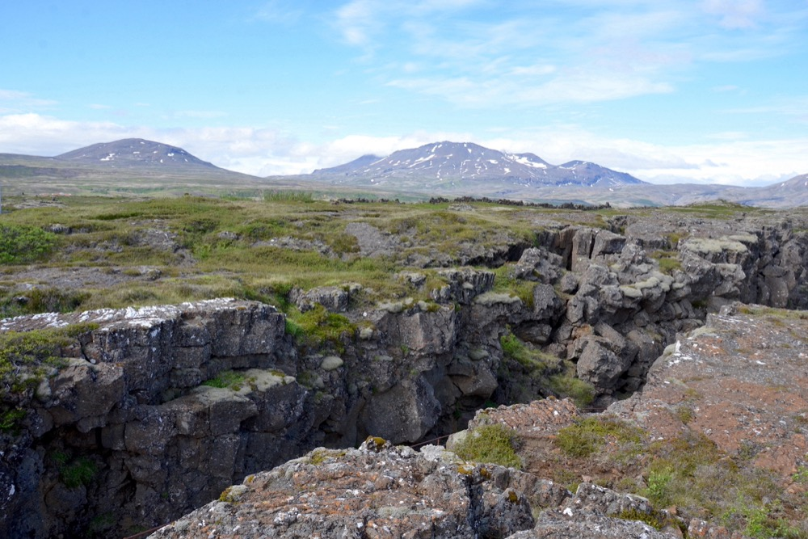
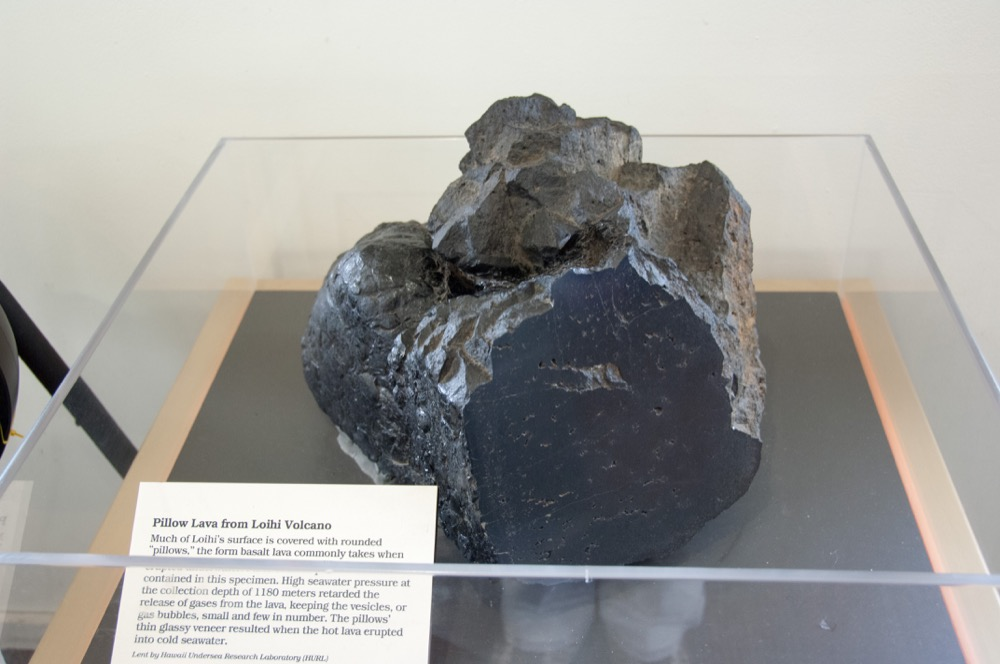
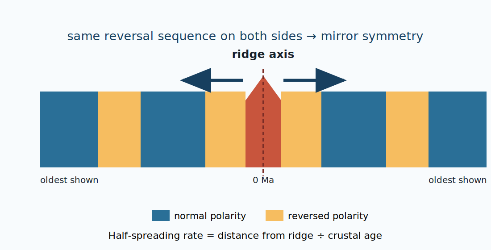
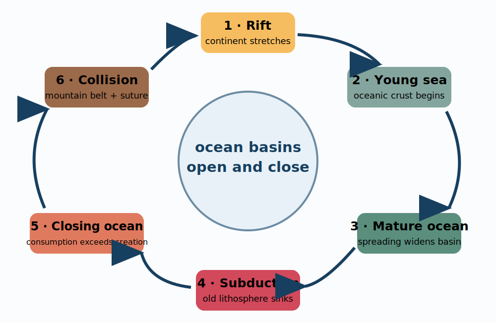

# Chapter 1: Plate Tectonics

:::info
**Reference:** English Wikipedia topic corpus, five revision-bound articles (CC BY-SA 4.0)
**Audience:** Introductory undergraduate Earth-science learners
**Package license:** CC-BY-SA-4.0
**Note:** The chapter reorganizes the source corpus around model building, prediction, and evidence.
:::

:::success
**Chapter Learning Objectives**

- **1.1a** Distinguish compositional layers from mechanical layers and explain why the lithosphere can move as plates.
- **1.2a** Classify plate boundaries from relative motion and predict characteristic geological expressions.
- **1.3a** Trace the creation, cooling, thickening, and recycling of oceanic lithosphere and compare contributions to plate motion.
- **1.4a** Use magnetic-stripe and age-distance evidence to test seafloor spreading and calculate spreading rates.
- **1.5a** Sequence a Wilson cycle and evaluate plate reconstructions with appropriate limits.
:::

## Chapter Logic

Plate tectonics is powerful because a small set of linked ideas explains many observations. Begin with **what can move**: a cool, rigid lithosphere lies above a hotter layer that deforms over geologic time. Add **how neighboring plates move**, and boundary geometry predicts ridges, trenches, faults, volcanic arcs, and mountain belts. Finally, ask whether those predictions agree with the age, magnetism, structure, and topography of real rocks.

{{mermaid
flowchart LR
  A[Mechanical layers] --> B[Coherent lithospheric plates]
  B --> C[Relative motion at boundaries]
  C --> D[Creation, deformation, or recycling]
  D --> E[Observable rock and geophysical records]
  E --> F[Plate reconstructions and Wilson cycles]
  F -. tests and refines .-> B
}}

**Visual description:** The reasoning forms a loop. Mechanical layers permit plate motion; relative motion produces boundary processes; those processes leave observations; observations support or revise reconstructions and the plate model.

:::warning
**Model boundary:** “Rigid plate” and “three boundary types” are useful first approximations. Plates deform internally, some boundaries are broad, and oblique motion can combine convergence or divergence with lateral shear.
:::

## 1.1 Mechanical Layers and Moving Plates{{attrs[#blk-lithos01]}}

:::success
**Learning Objectives**

- Separate the crust–mantle classification from the lithosphere–asthenosphere classification.
- Explain how solid rock can be weak enough to deform over millions of years.
- Compare oceanic and continental lithosphere without equating a plate with a continent.
:::

Earth's outer layers can be named in two different ways because the classifications answer different questions. **Crust** and **mantle** distinguish composition and mineralogy. **Lithosphere** and **asthenosphere** distinguish mechanical behavior. The lithosphere contains the crust plus the cool uppermost mantle; the asthenosphere is deeper upper mantle that is hotter and mechanically weaker.

*Figure 1.1 — Mechanical layering. The dashed boundary separates the rigid lithosphere from the weaker asthenosphere; it does not coincide with the crust–mantle compositional boundary. Self-generated by Yu Wang, CC BY-SA 4.0.*

The asthenosphere is not a planet-wide ocean of liquid magma. It is mostly solid rock. Given high temperature, pressure, and enough time, however, that solid can deform by viscous and plastic processes. A familiar analogy is a firm wax or very thick putty: it may resist a quick tap yet change shape under a sustained load. The timescale matters. Lithospheric rock can respond elastically or fail brittly on shorter timescales, while the asthenosphere can accommodate long-term strain.

| Classification | Upper category | Lower category | Property used |
|---|---|---|---|
| Compositional | Crust | Mantle | Chemistry and mineralogy |
| Mechanical | Lithosphere | Asthenosphere | Response to stress and temperature |

Oceanic and continental regions differ, but a tectonic plate can carry either or both. Oceanic lithosphere begins hot and thin at a mid-ocean ridge. As it travels away, conductive cooling adds a thicker mantle portion to its base and increases its average density. Continental lithosphere is compositionally more buoyant and may persist for billions of years; ancient continental roots can be especially thick.

:::info
**Everyday scale:** Common plate speeds are comparable to the growth of fingernails or hair—centimeters per year. The motion is nearly imperceptible during a day but can rearrange an ocean basin over tens of millions of years.
:::

:::: tabs
::: tab Problem
**Worked example — two classification schemes**

A seismic interpretation places a boundary within the upper mantle. Above it, rock responds rigidly over long times; below it, rock deforms more readily. Is this necessarily the crust–mantle boundary? Name the boundary that the evidence supports.
:::
::: tab Solution
No. The observation concerns **mechanical response**, not composition. It supports a **lithosphere–asthenosphere boundary**. The crust–mantle boundary, or Moho, is defined mainly by a compositional and seismic-velocity contrast and lies within the lithosphere in most settings.
:::
::::

**Self-check:**

- Sketch the crust, lithospheric mantle, and asthenosphere without making the asthenosphere liquid.
- Explain why “continental plate” can be a misleading phrase.
- What time-dependent behavior lets solid mantle participate in convection?

## 1.2 Boundary Kinematics and Surface Expression{{attrs[#blk-boundary02]}}

:::success
**Learning Objectives**

- Classify divergent, convergent, and transform motion using velocity arrows.
- Predict first-order landforms, volcanism, and earthquake patterns.
- Distinguish oceanic subduction from continent–continent collision.
:::

A plate boundary is classified by **relative motion**, not by the name of a nearby landform. Draw arrows on both sides of the boundary before predicting anything else. Plates moving apart define a divergent boundary; plates approaching one another define a convergent boundary; plates sliding laterally past one another define a transform boundary.

*Figure 1.2 — Idealized boundary types. Divergence creates crust, convergence can recycle oceanic lithosphere, and transform motion transfers material laterally. Self-generated by Yu Wang, CC BY-SA 4.0.*

At a **divergent boundary**, extension fractures the lithosphere. In an ocean basin, mantle rises as plates separate, partially melts because pressure decreases, and supplies basaltic magma to the ridge. New oceanic crust is created along a narrow accretion zone. Continental divergence can begin as a rift; if separation continues, the rift may flood and develop oceanic crust.

At a **convergent boundary**, the outcome depends strongly on lithospheric buoyancy. Old, cold oceanic lithosphere can sink beneath another plate. A trench marks bending at the surface, earthquakes trace the descending slab, and fluids released from the slab promote melting in the mantle wedge above it. The resulting magma can feed a continental volcanic arc or an island arc. When two buoyant continental masses meet after an intervening ocean has closed, neither readily descends deep into the mantle; shortening thickens and uplifts the crust into a mountain belt.

At a **transform boundary**, plates slide past each other. Lithosphere is neither systematically created nor destroyed. Friction can lock a fault while plate motion continues, storing elastic strain that is released in earthquakes. Transform faults also offset spreading-ridge segments, so a map may show lateral motion embedded within a larger divergent system.

| Relative motion | First-order crustal budget | Common expressions | Typical earthquake depth pattern |
|---|---|---|---|
| Apart | Creation at oceanic ridges | Ridge or continental rift; basaltic volcanism | Mostly shallow |
| Together with subduction | Recycling of oceanic lithosphere | Trench, volcanic arc, forearc, deepening earthquake zone | Shallow to deep along slab |
| Together in continental collision | Crustal shortening and thickening | Fold-thrust belts, high plateaus, mountains | Mostly shallow to intermediate |
| Lateral | Little net creation or destruction | Strike-slip fault zones, offset features | Mostly shallow |

*Figure 1.3 — Almannagjá at Þingvellir, where extension within Iceland exposes part of the Mid-Atlantic plate-boundary zone. Photo: Olga Ernst, [Wikimedia Commons](https://commons.wikimedia.org/wiki/File:Almannagjá_rift_at_Þingvellir_National_Park.jpg), CC BY-SA 4.0. Cropped/resized for this package.*

The photograph is not a complete cross-section of a plate boundary; it is field evidence of faulting and extension within a broad, volcanically active ridge zone. A good interpretation combines the observation with maps, earthquake data, geodesy, and rock ages.

:::: tabs
::: tab Problem
**Worked example — diagnose before naming**

Two GPS stations on opposite sides of a boundary have relative velocity components of 30 mm/yr toward one another and 18 mm/yr parallel to the boundary. Which idealized class dominates, and what complication should appear in the interpretation?
:::
::: tab Solution
The toward-boundary component is larger, so **convergence dominates**. The 18 mm/yr parallel component is substantial, however, so the boundary is **obliquely convergent**. Expect shortening or subduction together with lateral, strike-slip partitioning rather than a perfectly perpendicular collision.
:::
::::

**Self-check:**

- Why does the same convergent arrow pattern not guarantee the same landforms everywhere?
- Which observation would distinguish a transform fault from a spreading ridge?
- Explain why a continental rift can be an early stage rather than a failed version of an ocean ridge.

## 1.3 Creation, Cooling, and Recycling of Oceanic Lithosphere{{attrs[#blk-cycle003]}}

:::success
**Learning Objectives**

- Trace oceanic lithosphere from ridge formation through cooling to subduction.
- Connect age, temperature, thickness, density, and seafloor depth.
- Compare slab pull, gravitational sliding, and mantle-flow coupling.
:::

Seafloor spreading creates new oceanic crust where plates diverge at a mid-ocean ridge. Basaltic magma rises through fractures and solidifies, while mantle material cools into the base of the growing lithosphere. The ridge is therefore both a plate boundary and a moving material-production system.

*Figure 1.4 — A displayed pillow-lava specimen produced by basaltic eruption under water. The photograph shows a collected product of submarine volcanism, not an in-place flow or a whole spreading ridge. Photo: Ed Shiinoki, National Park Service, [Wikimedia Commons](https://commons.wikimedia.org/wiki/File:Pillow_Lava_from_Loihi_Seamount_in_Hawaii_USA.jpg), public domain. Resized for this package.*

Distance from a ridge can function as a rough time coordinate: at a steady half-spreading rate $v$, crustal age is

$$t = \frac{d}{v}.$$

As that age increases, conductive cooling makes oceanic lithosphere thicker and denser. Cooling also reduces thermal buoyancy, so older seafloor generally lies deeper than the ridge crest. The simplest cooling models relate thermal-boundary-layer thickness and depth change to the square root of age; real seafloor is modified by sediments, volcanism, flexure, and other processes.

Eventually, sufficiently dense oceanic lithosphere may bend into a trench and descend. This recycling is the other half of the global crustal budget. If new surface area is added at spreading centers while Earth's radius remains approximately constant, comparable area must be lost elsewhere over long timescales.

{{mermaid
flowchart LR
  A[Hot, thin ridge lithosphere] --> B[Moves away]
  B --> C[Conductive cooling]
  C --> D[Thicker, denser oceanic lithosphere]
  D --> E[Subduction and mantle return]
  E --> F[Mantle circulation and melting]
  F --> A
}}

**Visual description:** Oceanic lithosphere begins hot and thin at a ridge, cools and thickens as it moves, becomes dense enough to participate in subduction, and returns material to the mantle; mantle processes then supply material to spreading centers.

What drives the motion? Avoid the cartoon in which a single rolling convection cell drags every plate like a conveyor belt. Earth's plate–mantle system is coupled. Where a cold slab sinks, its weight can exert **slab pull**, widely regarded as a strong contribution. Elevated ridges allow a gravitational tendency to slide away from the ridge, often called ridge push. Flow in the mantle responds to and influences slabs, ridges, plumes, and plate geometry. Different plates need not have identical force balances.

:::warning
**Language check:** Magma forms crust at a ridge, but “magma pressure pushes the plates apart” is not a complete driving explanation. Plate separation permits decompression melting; the larger motion reflects gravity, sinking slabs, mantle flow, and boundary forces acting together.
:::

:::: tabs
::: tab Problem
**Worked example — crustal budget**

A 1,500-km ridge segment opens at a full spreading rate of 60 mm/yr. Estimate the new seafloor area produced per year, counting the total widening across both flanks. Express the answer in square kilometers per year.
:::
::: tab Solution
Convert the full rate: $60\ \text{mm/yr}=6.0\times10^{-5}\ \text{km/yr}$.

Then

$$A = L\Delta x=(1500\ \text{km})(6.0\times10^{-5}\ \text{km/yr})=0.090\ \text{km}^2/\text{yr}.$$

The value is small per year but accumulates to $900\ \text{km}^2$ in 10,000 years if the rate and segment length remain constant.
:::
::::

**Self-check:**

- Why does oceanic lithosphere thicken even though crustal thickness changes much less?
- Explain why older ocean floor is generally deeper.
- Which part of the global crustal budget would fail if subduction stopped but spreading continued?

## 1.4 Reading the Magnetic and Age Record{{attrs[#blk-magnetic4]}}

:::success
**Learning Objectives**

- Explain how basalt can preserve an ancient magnetic-field direction.
- Use symmetry and age patterns to test seafloor spreading.
- Distinguish a half-spreading rate from a full-spreading rate.
:::

Paleomagnetism studies magnetic fields recorded by rocks, sediment, and archaeological materials. For seafloor spreading, the key recorder is iron-bearing minerals in basalt. As lava cools, magnetic grains can acquire **thermoremanent magnetization** aligned with Earth's field. The field has reversed polarity many times, so crust formed during different intervals can preserve alternating normal and reversed directions.

*Figure 1.5 — Seafloor spreading predicts symmetric magnetic polarity sequences and outward-increasing crustal age. Self-generated by Yu Wang, CC BY-SA 4.0.*

The strongest inference comes from a pattern, not a single magnetized sample:

1. The youngest crust occurs at the ridge axis.
2. Ages generally increase away from the axis.
3. Alternating polarity bands run roughly parallel to the ridge.
4. The sequence on one flank resembles the reverse-order sequence on the other.

This joint prediction links an independently documented reversal history to a mechanism that continually creates and separates crust. It also permits quantitative motion estimates.

For a dated magnetic boundary at age $t$ and perpendicular distance $d$ from the ridge, the mean **half-spreading rate** is

$$v_{1/2}=\frac{d}{t}.$$

If two sides are symmetric, the full opening rate is approximately $2v_{1/2}$. A convenient conversion is

$$1\ \text{km/Myr}=1\ \text{mm/yr}.$$

Thus a stripe 300 km from a ridge with age 10 Ma gives $30\ \text{km/Myr}=30\ \text{mm/yr}$ on that flank and an estimated symmetric full rate of $60\ \text{mm/yr}$.

:::info
**Evidence is layered:** Magnetic stripes support spreading, but paleomagnetic records can be altered by later heating, chemical change, deformation, or contamination. Investigators compare sites, remove secondary magnetizations, date rocks independently, and use uncertainty rather than trusting one reading.
:::

:::: tabs
::: tab Problem
**Worked example — asymmetric spreading**

The same 8.0 Ma reversal is 160 km west of a ridge and 184 km east of it. Find each half-rate and the full opening rate. Is perfect symmetry supported?
:::
::: tab Solution
West half-rate:

$$v_W=160/8.0=20\ \text{km/Myr}=20\ \text{mm/yr}.$$

East half-rate:

$$v_E=184/8.0=23\ \text{km/Myr}=23\ \text{mm/yr}.$$

Full opening rate:

$$v_{full}=v_W+v_E=43\ \text{mm/yr}.$$

The flanks preserve the same reversal but differ by 3 mm/yr in their mean half-rates, so perfect symmetry is not supported. The pattern can still be consistent with seafloor spreading.
:::
::::

**Self-check:**

- Why is mirror symmetry more diagnostic than the presence of magnetized basalt alone?
- When should a half-rate be doubled?
- Name two processes that could complicate a magnetic record.

## 1.5 Ocean-Basin Life Cycles and Model Limits{{attrs[#blk-wilson005]}}

:::success
**Learning Objectives**

- Sequence six idealized stages in the opening and closing of an ocean basin.
- Connect boundary processes to the geological record left after collision.
- Identify which observations constrain a reconstruction and what they cannot determine alone.
:::

The **Wilson cycle** is a model for the opening and closing of ocean basins. It integrates the boundary processes already studied rather than adding a new mechanism. An idealized sequence begins with continental rifting, progresses through a young sea and mature spreading ocean, shifts toward subduction and basin closure, and culminates in continental collision and a suture zone.

*Figure 1.6 — An idealized Wilson cycle. Real basins can be asymmetric, interrupted, or reorganized. Self-generated by Yu Wang, CC BY-SA 4.0.*

| Stage | Dominant process | Evidence that may remain |
|---|---|---|
| Continental rift | Extension and thinning | Rift faults, basins, volcanism, failed rift arms |
| Young sea | First sustained oceanic crust | Narrow marine basin, evaporites, transitional margins |
| Mature ocean | Long-lived spreading | Passive margins, broad ocean floor, symmetric age and magnetic patterns |
| Subduction | Oceanic-lithosphere recycling | Trenches, arcs, earthquakes, accretionary complexes |
| Closing ocean | Consumption outpaces creation | Narrowing basin, approaching arcs and continents |
| Collision and suture | Continental shortening and thickening | Mountain belt, deformed margins, ophiolites, metamorphic and structural suture evidence |

One attraction of the Wilson-cycle concept is inheritance: a former collision or suture can remain mechanically distinct, and later rifting may exploit that weakness. Yet the cycle is not synchronized globally, and it is distinct from the broader supercontinent cycle. Ocean basins can change boundaries, develop asymmetrically, or fail to pass through every textbook stage.

Plate reconstruction therefore uses multiple constraints. Geometric continental fit is useful but not sufficient. Marine magnetic stripes and dated oceanic crust provide strong relative-motion constraints for younger oceans. Paleomagnetic directions can constrain ancient latitude and rotation, while fossils, sedimentary environments, matching rock belts, and mountain structures add independent clues. Hotspot tracks can sometimes provide another reference, though assumptions about hotspot motion matter.

:::warning
**Uncertainty grows backward in time:** Oceanic lithosphere is recycled, so direct seafloor records disappear. Paleomagnetism usually constrains latitude and rotation more readily than longitude. A reconstruction is a tested synthesis with uncertainty, not a frame-by-frame recording.
:::

:::: tabs
::: tab Problem
**Worked example — evaluate a reconstruction claim**

A reconstruction places two continents together 450 Ma ago because their coastlines look complementary. List two additional evidence types that would strengthen the claim and one limitation that should remain visible.
:::
::: tab Solution
Useful independent tests include matching dated rock belts or mountain structures across the proposed join, compatible fossil or sedimentary provinces, and paleomagnetic directions that give consistent paleolatitudes and rotations. A key limitation is that modern coastlines are shaped by erosion, sedimentation, and sea level; they are not the original rift edges. In addition, paleomagnetism alone may not fix relative longitude.
:::
::::

**Self-check:**

- Which Wilson-cycle stages are dominated by divergence, and which by convergence?
- What geological feature marks a vanished ocean after collision?
- Why must plate reconstructions combine evidence types?

## Synthesis

One thread connects the chapter: **material behavior permits motion, relative motion predicts processes, and preserved observations test the predictions**. Ridges create oceanic lithosphere; cooling changes its thickness and density; subduction recycles it; transform boundaries accommodate lateral motion; and rocks preserve enough age, magnetic, structural, and geographic information to reconstruct part of that history. The Wilson cycle is the basin-scale expression of these linked processes.

When solving a plate-tectonics problem, use four questions in order:

1. What material or boundary is being described?
2. What is the direction of relative motion?
3. What processes and observations should follow?
4. Which evidence could falsify or qualify the interpretation?

## Asset and License Record for This Chapter

| Asset | Source URL | License | Attribution |
|---|---|---|---|
| `lithosphere-asthenosphere.svg` | Original in this package | CC BY-SA 4.0 | Yu Wang |
| `plate-boundary-types.svg` | Original in this package | CC BY-SA 4.0 | Yu Wang |
| `thingvellir-rift.jpg` | https://commons.wikimedia.org/wiki/File:Almannagjá_rift_at_Þingvellir_National_Park.jpg | CC BY-SA 4.0 | Olga Ernst; cropped/resized |
| `pillow-lava-loihi.jpg` | https://commons.wikimedia.org/wiki/File:Pillow_Lava_from_Loihi_Seamount_in_Hawaii_USA.jpg | Public domain | Ed Shiinoki, National Park Service; resized |
| `magnetic-stripes.svg` | Original in this package | CC BY-SA 4.0 | Yu Wang |
| `wilson-cycle.svg` | Original in this package | CC BY-SA 4.0 | Yu Wang |

## Source Adaptation Note

Adapted and reorganized for this teaching resource. Sources: Wikipedia contributors, [Plate tectonics](https://en.wikipedia.org/wiki/Plate_tectonics), [Lithosphere](https://en.wikipedia.org/wiki/Lithosphere), [Seafloor spreading](https://en.wikipedia.org/wiki/Seafloor_spreading), [Paleomagnetism](https://en.wikipedia.org/wiki/Paleomagnetism), and [Wilson Cycle](https://en.wikipedia.org/wiki/Wilson_Cycle), licensed under [CC BY-SA 4.0](https://creativecommons.org/licenses/by-sa/4.0/).
